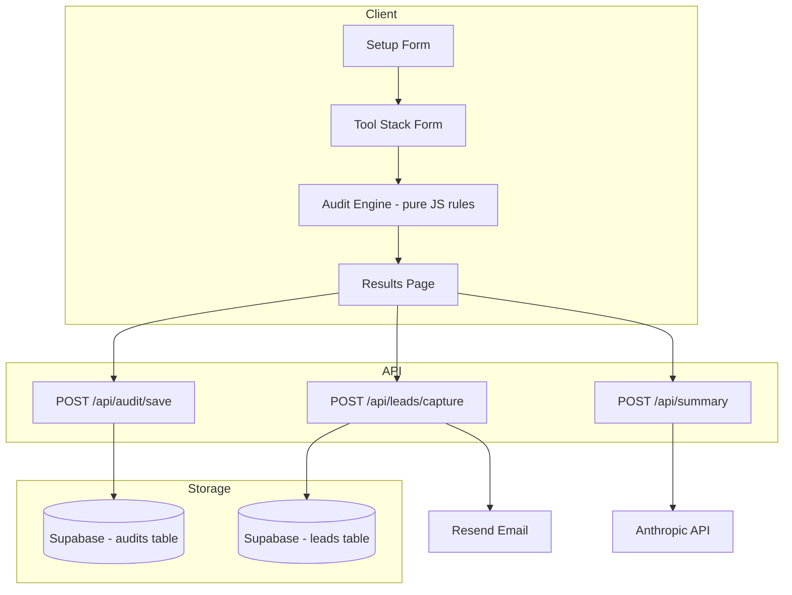

# Architecture — SpendSage

## System Diagram

## Why This Stack

- Next.js 14 — SSR for OG tags on shareable URLs
- TypeScript — catch type errors in audit logic at compile time
- Tailwind CSS — utility-first, Lighthouse performance stays high
- Supabase — Postgres for real queries on lead data
- Resend — transactional email, 3000 free emails per month
- Anthropic API — personalized audit summary generation

## Handling 10,000 Audits Per Day

1. Move audit save to background job via Inngest
2. Cache pricing data in Vercel KV edge config
3. Rate limit at edge with Vercel Edge Middleware
4. Switch Supabase to PgBouncer connection pooling mode
5. Queue Anthropic API summary calls via BullMQ
